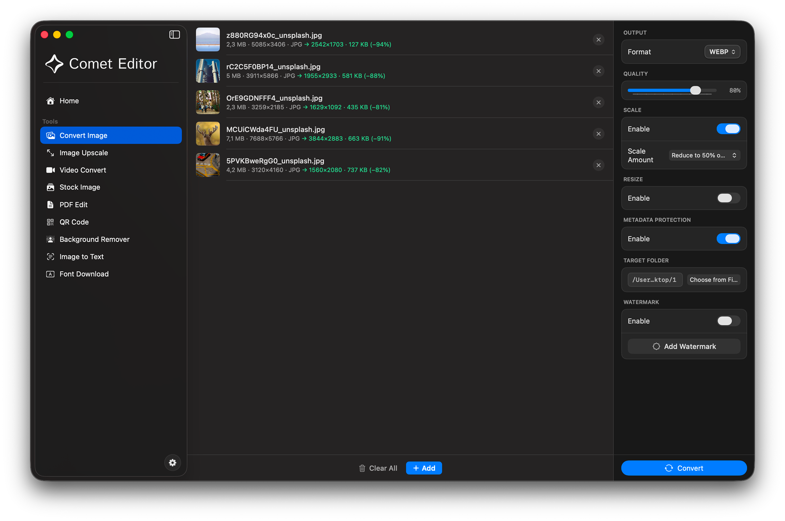
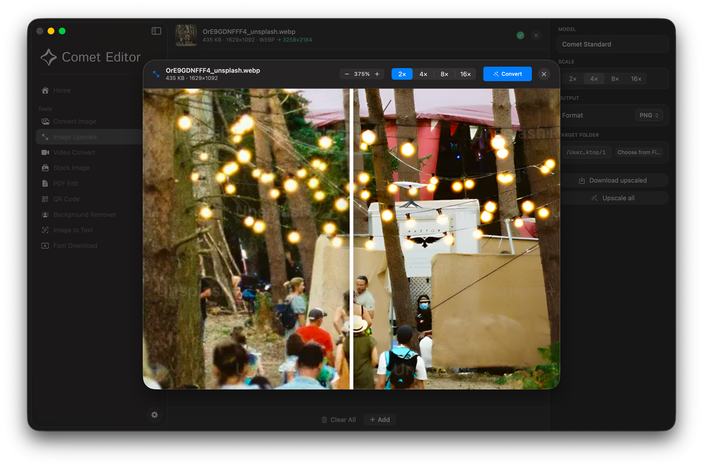
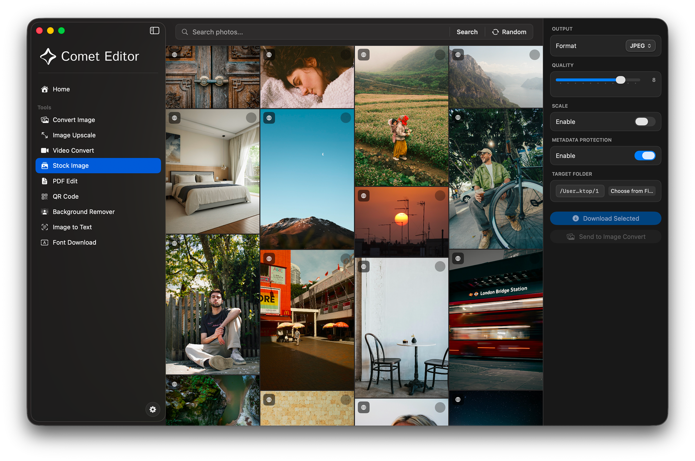
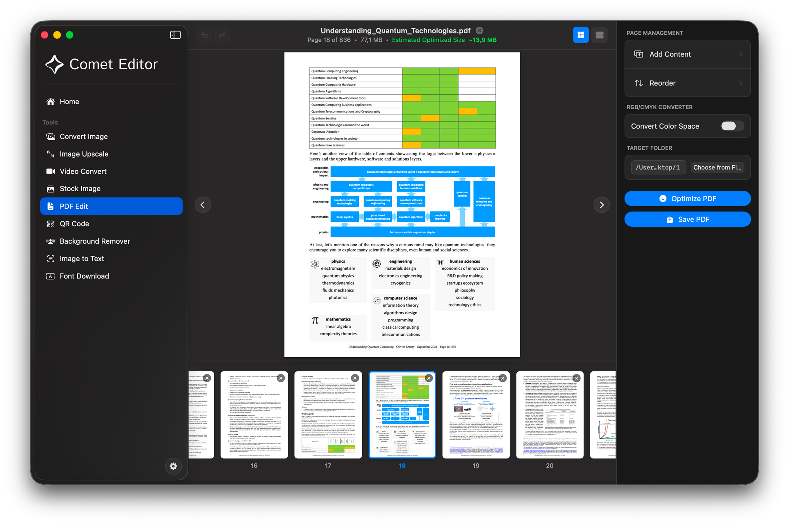
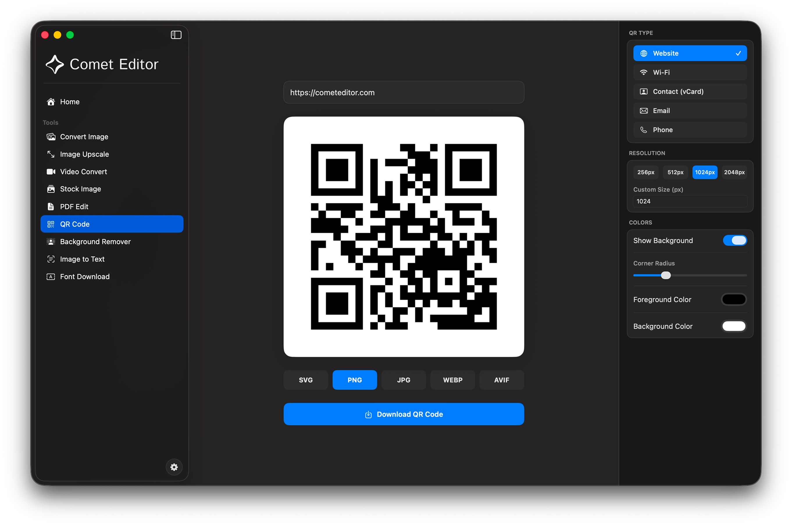
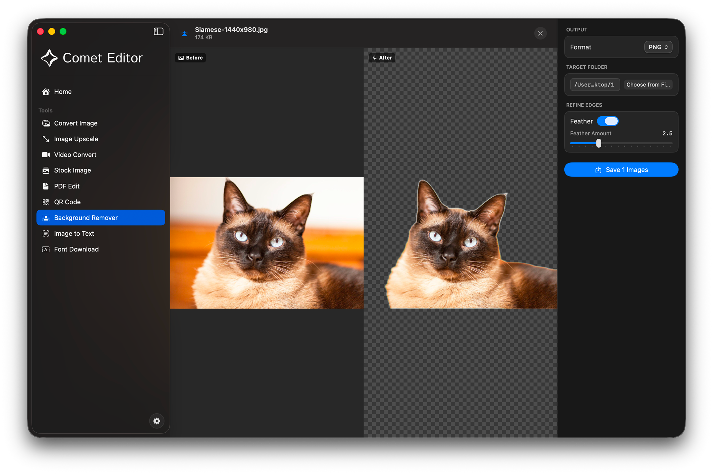
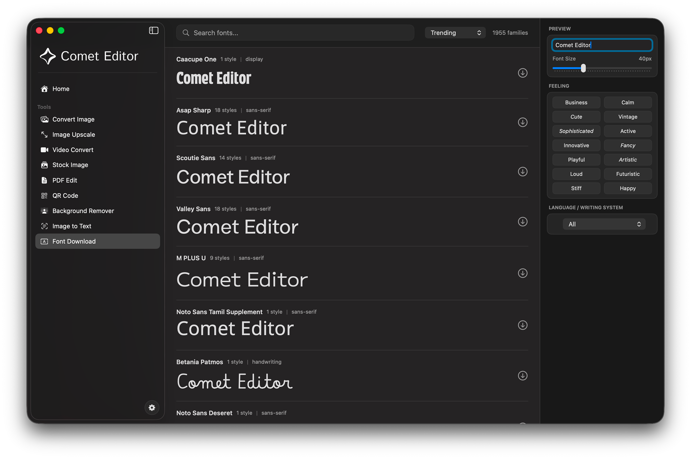

# Comet Editor

macOS için yerel bir medya aracı. Görüntü dönüştürme, AI ile büyütme, video dönüştürme, PDF düzenleme, arka plan kaldırma, OCR, QR kod, stok fotoğraf ve font indirme tek uygulamada toplanır.

İşlemler cihazda yürür; görüntüler ve videolar bir sunucuya yüklenmez. Sandbox’lı bir Mac uygulamasıdır (`com.cometeditor.app`).

**Sürüm:** 2.0 · **Minimum:** macOS 13.0 · **Site:** [cometeditor.com](https://cometeditor.com)

<p align="center">
  
</p>

<p align="center">
  
</p>

## Özellikler

| Araç | Ne işe yarar |
| --- | --- |
| **Görüntü dönüştürme** | PNG, JPEG, HEIC, WebP, AVIF, TIFF, GIF, BMP, ICO, SVG, PSD, RAW ve diğer formatlar. Kalite, ölçek, boyut, metadata koruması, toplu işlem ve filigran (metin veya logo). |
| **Görüntü büyütme** | Cihaz içi AI upscaler (`cometscaly`, Upscayl Standard 4×). 2×–16×; 8× ve 16× birden fazla geçiş yapar. Önizleme kaydırıcısı ile önce/sonra karşılaştırması. |
| **Video dönüştürme** | MP4, MOV, MKV, AVI, WebM, GIF, M4V, MPEG, 3GP, FLV, WMV. FPS, çözünürlük, sesi kaldırma. FFmpeg ile yerel encode. |
| **Stok fotoğraf** | [Unsplash](https://unsplash.com) üzerinden arama ve indirme. |
| **PDF düzenleme** | Sayfa silme, yeniden sıralama, sıkıştırma, PDF veya görüntü ekleme. |
| **QR kod** | Web sitesi, Wi-Fi, vCard, e-posta ve telefon. PNG, SVG, JPG, WebP, AVIF dışa aktarma. |
| **Arka plan kaldırma** | Apple Neural Engine ile yerelde maskeleme. En iyi sonuç için macOS 14 Sonoma veya üzeri. |
| **Görüntüden metin (OCR)** | Vision ile metin çıkarma; kopyalama veya dosya olarak kaydetme. |
| **Font indirme** | Google Fonts kataloğu; seçilen stilleri Mac’e kurma. |

### Görüntü büyütme

<p align="center">
  
</p>

### Stok fotoğraf

<p align="center">
  
</p>

### PDF düzenleme

<p align="center">
  
</p>

### QR kod

<p align="center">
  
</p>

### Arka plan kaldırma

<p align="center">
  
</p>

### Font indirme

<p align="center">
  
</p>

Ana sayfada sık kullanılan işler için hazır ayarlar vardır (ör. görüntüyü küçült, PNG → WebP, PDF aç).

Uygulama içi dil seçici onlarca dili kapsar (Türkçe, İngilizce, Almanca, Japonca, Arapça ve diğerleri).

## Gereksinimler

- macOS 13.0 veya üzeri (arka plan kaldırma için 14.0 önerilir)
- Xcode 16 veya üzeri (Swift 5, SwiftUI)
- Apple Development imzalama (sandbox ve hardened runtime)

Projede ImageMagick, FFmpeg ve upscale modelleri `third_party/` altında hazır gelir; ayrı Homebrew kurulumu gerekmez.

## Geliştirme

```bash
git clone https://github.com/boracomet/Comet-Editor.git
cd Comet-Editor
open cometeditor.xcodeproj
```

Xcode’da **Comet Editor** scheme’ini seçip çalıştırın.

### Google Fonts anahtarı

Font indirme aracı Google Fonts Webfonts API kullanır. Anahtar kaynak kodda yoktur.

1. `cometeditor/Secrets.example.plist` dosyasını `cometeditor/Secrets.plist` olarak kopyalayın.
2. `GoogleFontsAPIKey` değerini kendi anahtarınızla değiştirin.
3. `Secrets.plist` git’e eklenmez.

Dosya yoksa uygulama derlenir; font listesi yüklenmez.

Unsplash erişimi public Client-ID ile çalışır; ek ayar gerekmez.

## Mimari (kısa)

| Katman | Teknoloji |
| --- | --- |
| Arayüz | SwiftUI, macOS NavigationSplitView |
| Görüntü codec | ImageMagick 7 (`CometCodecBridge`) |
| Video | FFmpeg (`FFmpegBridge`, `VideoProcessor`) |
| Büyütme | `cometscaly` + NCNN modelleri (`UpscaleEngine`) |
| Arka plan / OCR | Vision / Neural Engine |
| Yerelleştirme | `i18n/master.json` → `*.lproj/Localizable.strings` |

Yerelleştirme anahtarları `i18n/` altındadır. String ekledikten sonra ilgili senkron script’leri kullanın; `Localizable.strings` dosyalarını elle karıştırmayın.

## Lisans

[MIT](LICENSE) © 2026 Bora Ata Türkoğlu

Geliştirme: [Bora Ata Türkoğlu](https://boraturkoglu.com) · Görsel katkı: [Beyza Nur Keçeli](https://www.linkedin.com/in/beyzanurkeceli/)
